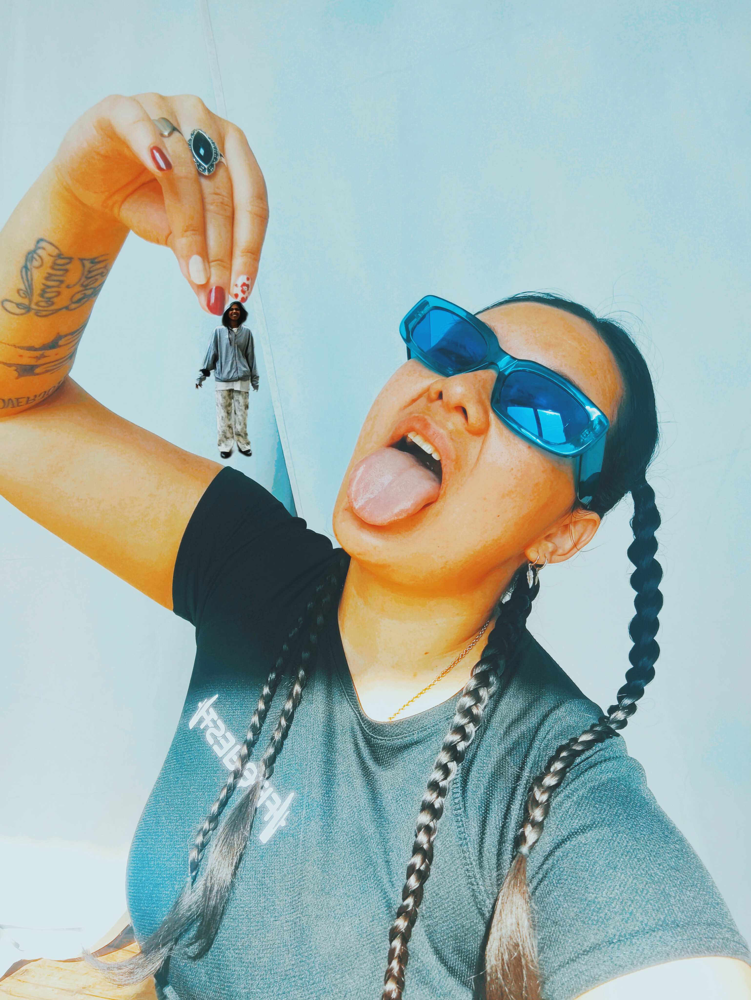
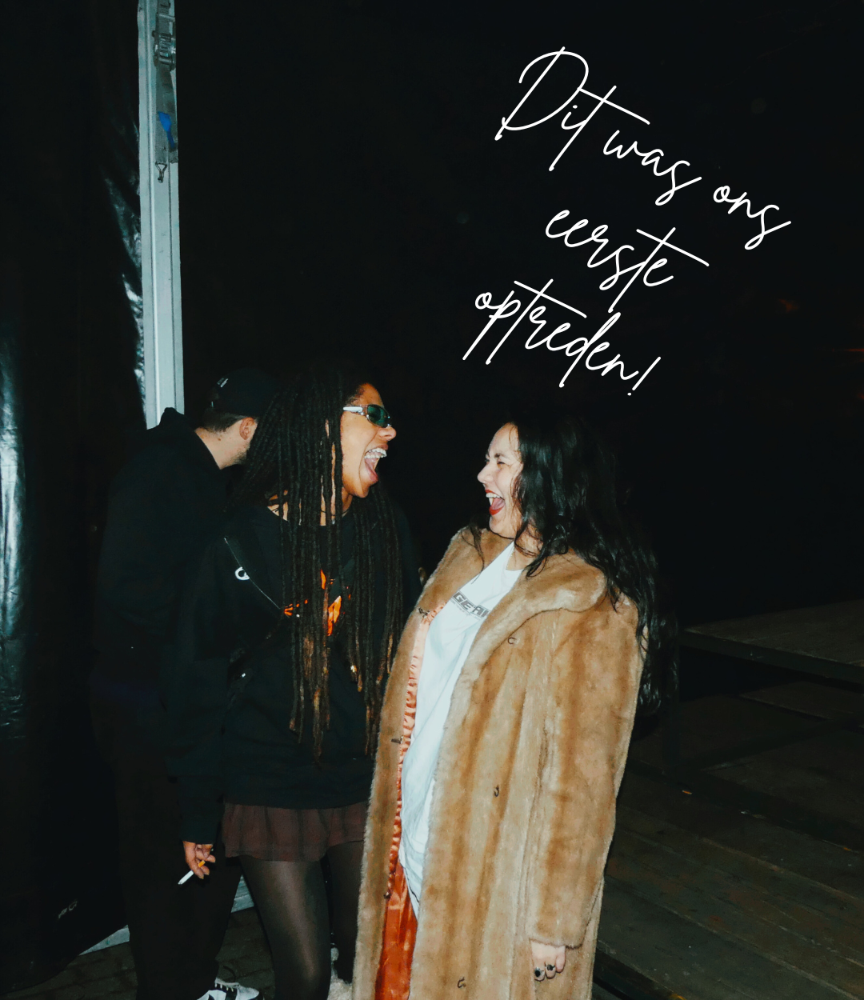

# **WOMANCE**
## *een bromance, maar beter*

🎧 [Spotify](https://open.spotify.com/artist/7cyNW498a5ZjNsYXC6TmeN?si=m0XT0mAwRNm7J9Ih9u-Svw) &nbsp;&nbsp; 🎥 [YouTube](https://youtube.com/@wo_mance) &nbsp;&nbsp; 📸 [Instagram](https://instagram.com/womance_) &nbsp;&nbsp; 🎤 [TikTok](https://tiktok.com/womance_)

  

> “Wat als gevoel en maatschappijkritiek samen muziek maken?” — WOMANCE

  

    

      
    

    
<strong>Ayisha</strong> <em>de spiegel</em>

    
Zij voelt de wereld. Alles wat rauw is, echt is, daar zoomt Ayisha in. Ze is het maatschappelijk geweten dat woorden geeft aan wat meestal alleen gevoeld wordt.

  

  

    

      
    

    
<strong>Betty</strong> <em>de les</em>

    
Betty vertaalt gevoel naar les. Haar kracht zit in de kwetsbare eenvoud waarmee ze een boodschap blootlegt. Waar Ayisha triggert, brengt Betty troost.

  

  

    
    
<strong>WOMANCE</strong> — waar confrontatie en compassie samenkomen.

  

---

### 📥 Press Kit
- 🇳🇱 [Bekijk de EPK (Nederlands)](epk-nl.md)
- 🇬🇧 [View the EPK (English)](epk-en.md)
- 💾 [Download EPK (ZIP)](../public/womance-epk.zip)

---

### 📸 Persbeeld & Covers
- Zie [assets/press](../assets/press)

---

### 💬 Quotes & Pers
- [press-quotes.md](press-quotes.md)

